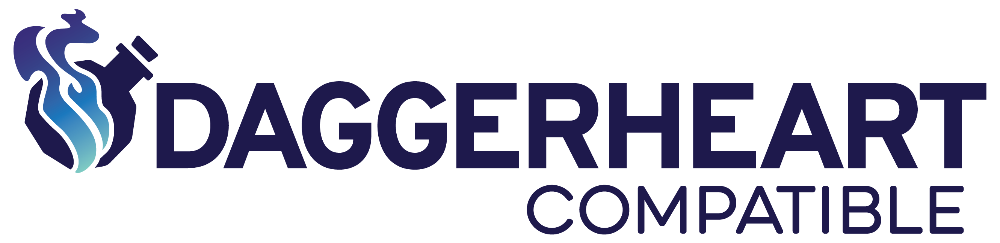
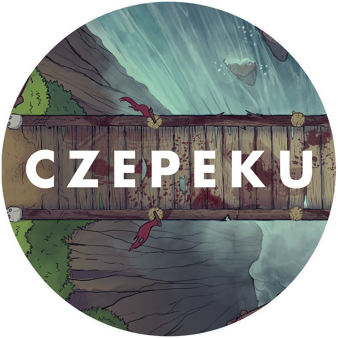

# The Southern Alliance
A Tier 1 one-shot adventure for DaggerHeart.

  

The Southern Alliance is a complete adventure module designed for DaggerHeart players and Game Masters. This one-shot adventure is perfect for introducing new players to the DaggerHeart system or as a standalone adventure for experienced groups.

# Installation

## Search Method
1. Open FoundryVTT and navigate to the "Add-on Modules" tab
2. Click "Install Module"
3. Search for "The Southern Alliance"
4. Click Install and enable the module

# How To
1. Install and activate the module in your DaggerHeart world
2. Navigate to the Compendiums tab
3. Open "The Southern Alliance" adventure compendium
4. Import the adventure to your world
5. Follow the adventure content and guidance provided

# Features
- Complete Tier 1 adventure content
- Pre-configured scenes and maps
- Ready-to-use NPCs and Environments

# System Requirements
- FoundryVTT v13 or later
- DaggerHeart system installed and activated

# License

This work is published under the terms of the Darrington Press Community Gaming (DPCGL) License, available at http://www.darringtonpress.com/license.

The maps are from Cze and Peku and are under their license available at https://www.czepeku.com/blog/commercial-use-licence.

